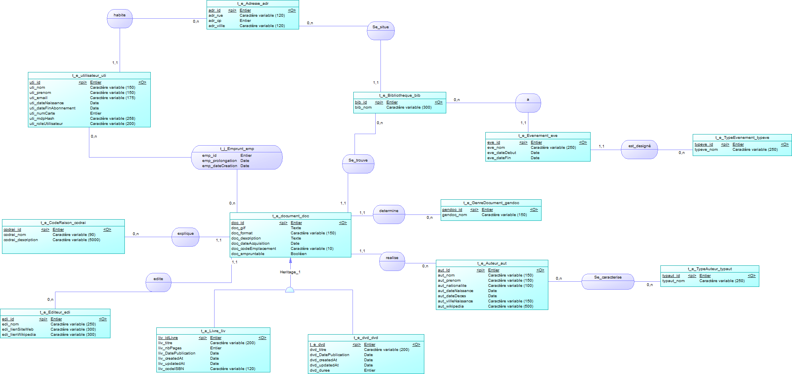
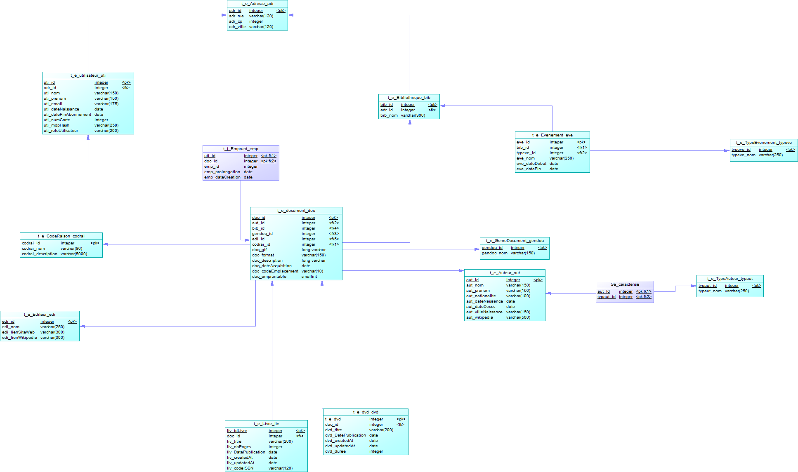

# SAE 6 : Bibliothèque

**Projet réalisé par Mohamed Faher, Pigné Jules, Rob Elioth et Stapleton Alexis**

Application déployée sur Azure : https://sae6-app-bhfaanebdzaxcjhe.swedencentral-01.azurewebsites.net/login

logins :

admin@biblio.fr
Admin1234

## Tableau des réalisations : ##

| Nom |                                                                                                                       Réalisations                                                                                                                        |  % |
|:-----------|:---------------------------------------------------------------------------------------------------------------------------------------------------------------------------------------------------------------------------------------------------------:|---:|
| Mohamed  | Gestion CRUD des documents, Recherche filtrée (type de document; type de recherche : commence par, contient ; recherche par champ : auteur, bibliotheque, etc.) Création Modèle de données (MCD, MPD), amélioration de service et dtos liés aux documents | 21 |
| Pigné  |                                                                         Gestion CRUD des éditeurs, gestion CRUD des adresses,  Page d'accueil, caroussel, amélioration du routing                                                                         | 21 |
| Rob  |                                         Docker-compose, gestion des comptes, ReadMe, Montée de versions, corrections de bugs, gestion des permissions, popup pour les abonnements arrivants a terme, power point                                          | 21 |
| Stapleton  |                                Migrations, Entitées, DTOs, Mapper, GlobalGenericService, Les services, Les Repositories, La page de gestion des Bibliothèques / Événements, tests unitaires, tests mock, déploiement azure et gestion des emprunt avec les differents restrictions                              | 37 |

**Fonctionnalités de l'application :**

Cette application permet de gérer des biblioothèques. Nous retrouvons les fonctionnalités suivantes : 

 - Gestion de comptes (avec différents rôles)
 - Gestion d'éditeurs
 - Gestion d'auteurs
 - Gestion de documents
 - Évènements

## Configuration de l'application

**Corrections**

Lors de notre analyse de l'application nous avons relevé un certain nombre d'axes d'améliorations : 

- présence de mots de passe en claire:
  
  Nous avons fait le choix de mettre en place un fichier .env afin de regrouper l'ensemble des mots de passe présents dans l'application. Dans la version initiale de l'application nous pouvions retrouver ces mots de passe dans le fichier applications.properties.
  
- incohérence de l'architecture

  L'architecture lors de la récupération de l'application présente une incohérence dans son utilisation de la couche controller. Le front fait appel directement au service. La couche controller n'est donc jamais appelée, elle ne fait que d'exposer les endpoints ce qui peut être une faille de sécurité.

- Mise à jour de l'application :

  Passage de SpringBoot 3.5.0 à 4.0.6 et de Vaadin 24.7.6 à 25.1.5. Cette mise à jour a demandé de modifier certaines dépendances de l'application sans pour autant présenter de gros changement.

**Docker**

Dans le but de faciliter la configuration de l'environnement de travail pour tous les développeurs (peu importe leur système) nous avons mis en place un Docker-compose qui permet de déployer une base de données PostgreSQL. 
  
## Modèle de données

Dans le but de générer un modèle de données nous avons utilisé des migrations. Le modèle est maintenant le suivant :

## Architecture de l'application 

Suite à la correction de l'application nous obtenons l'architecture suivante pour cette dernière : 

Cette dernière se sépare en différentes couches : 

La couche repository fait la jonction entre l'application et la base de données. 

La couche service va elle gérer la logique métier de l'application. 

La couche éditor va gérer l'edition des éléments

La couche view va gérer la composition des pages

Nous avons fait le choix du supprimer completement la couche controller qui n'était pas utilisée dans l'application.

## Bonnes pratiques

Afin de garantir un code de qualité nous avons mis en place certaines bonnes pratiques de code : 

- Utilisation d'injections de dépendances
- Pattern repository afin de centraliser l'accès aux données dans une seule couche
- Utilisation d'un docker compose en environnement de developpement afin de déployer très simplement une base de données postgreSQL
- Mise en place de DTOs afin de contrôler les données qui sont échangées dans l'application
- Utilisation d'abstract service afin de garder une logique commune.
- Emploi de GitFlow afin d'assurer un bon versioning du code

## Tests unitaires et test moq

Dans le but de fournir une application de qualité et de garantir cette dernière nous avons réalisé de nombreux tests tant Moq que Unitaire. 

Au total, 189 tests ont été effectués. 

Cela couvre ainsi une grande partie du code. Notamment les services, repository et mappers : 

## Exemple de code

Comme évoqué dans les bonnes pratiques nous avons utilisé un service générique. Cela permet de centraliser une même logique qui est commune à tous les services. Ainsi, dès que nous fabriquons un nouveau service, ce dernier possède déjà des fonctions utilisables. Dans le cas ou une fonction demande une logique différente du service générique, il est possible de override cette dernière et d'écrire notre propre logique. 

## Problèmes rencontrés et solutions :

- Selon les OS nous avons rencontré des problèmes afin de lancer le projet. L'utilisation de Docker nous a permis d'unifier l'usage des services.
- Nous avons fait face à des problèmes de versioning. L'utilisation de Gitflow nous a permis de rapidement identifier et corriger des problèmes afin qu'ils ne perdurent pas sur la branche develop.
- Le framework Vaadin nous à posé problème en début de SAE pour sa nouveauté, il a été nécessaire de comprendre son fonctionnement avant de développer des fonctionnalités trop complexes.
- La conception des données en début de projet a été effectué un peu trop rapidemment, les fichiers de migrations n'ont pas été conçus avec précision au début. Nous avons donc rajouté des contraintes et des séquences car il manquait des auto increment.

## Utilisation des IA

Lors du développement de notre application nous avons fait appel à Claude afin de nous aider. 
Cette dernière nous a servi d'assistante afin de débugger, faciliter la lecture de logs ou encore à faire des recherches plus rapides sur Vaadin, framework jusqu'alors inconnu. 

  

